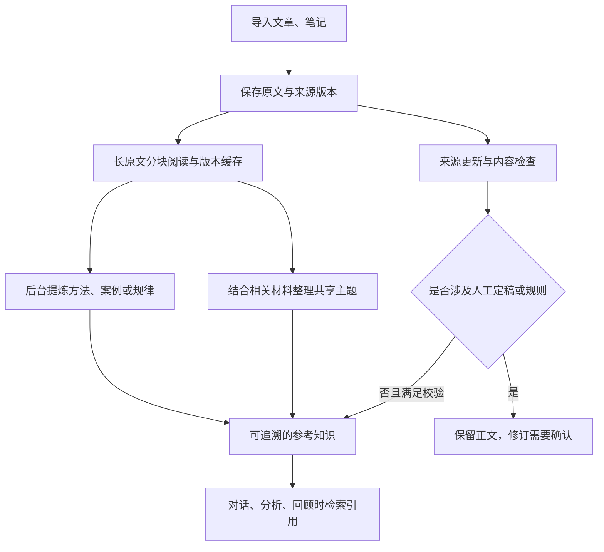

# LLM Wiki 的具体实现流程

更新日期：2026-09-29。本文说明 Elsewhen 当前代码的运行过程。

先保存原始材料，再由后台生成有出处的知识页；提问时检索这些知识，材料变化后继续维护。数据保存在 SQLite，Rust 负责整理和校验，Flutter 负责后台调度和页面展示。

下面以“构建 IP 系统的底层逻辑”文章为例。示例中的产出名称用于解释流程，不代表模型一定会生成这些页面。

## 1. 导入：先保存原文

系统保存正文、标题、URL、来源身份和内容版本。数据库分开记录：

| 表 | 用途 |
| --- | --- |
| `knowledge_sources` | 标识是哪份来源 |
| `knowledge_snapshots` | 保存来源某个版本的原文 |
| `wiki_pages` | 保存界面中可以阅读的页面 |
| `knowledge_page_sources` | 将知识页关联到具体来源版本，支持多对多 |

同一个 URL 后续导入了不同内容，经用户确认后保存新版本；旧版本保留。因此，知识引用可以明确指向文章的第 1 版，而不是永远指向已经变化的最新正文。

## 2. 单篇整理：自动生成参考知识

应用启动和运行期间检查待处理任务。调度器约每 5 秒检查一次，不代表每 5 秒都会请求模型；没有符合条件的任务就结束。

对外部原料，先按快照与阅读策略版本准备全文输入。1400 字以内直接阅读；更长的原文每 6000 字一块，每四块逐层归纳，进度和缓存写入数据库。重启后继续未读块，原文不变时复用缓存。摘要标明 AI 归纳，逐字摘录单独校验；分块覆盖全文，但归纳仍可能漏掉细节。

随后后台让模型选择最合适的一种产出：

- 方法：可以复用的步骤。
- 案例：具体情境中的做法和结果。
- 规律：有适用条件的归纳。
- 跳过：材料不足以形成有价值的知识。

IP 文章可能产生一个参考方法，不要求每篇文章都生成三种页面。模型返回结构化结果，包含标题、正文、适用条件和理由。Rust 校验结构、长度及来源，合格后保存；格式失败最多修复一次，再失败则记录任务失败并退避重试。

普通新增参考产出直接保存，原文保持不变。页面里的“提炼知识”让用户按需指定类型，也遵守同样的保存边界。历史人工待审或拒绝决定仍有效；单篇后台整理会跳过已有人工定稿，来源更新后，逐页面任务自动准备待确认修订；用户也可按需检查更新。

## 3. 跨资料整理：维护共同主题

独立的跨资料整理任务以当前文章为起点，用标题、标签、摘要检索相关知识，再取出背后的原料。如果库里还有另一篇内容定位文章，模型可以比较两者，生成或更新“IP 定位与内容生产”这样的共享主题。

这一步要求：

- 一个主题至少引用两份独立来源。
- 优先更新已有主题，保留其标题和身份。
- 更新时保留已有来源，不能丢掉旧依据。
- 分歧保留条件和出处，不擅自选一方作为结论。

主题与原料通过快照关系关联。从两篇文章的“产出”可以进入同一张主题页，也能从主题返回两篇原文。

相关主题发现每轮最多提供 8 份来源和 3 个已有主题，使用短原文或全文阅读归纳及原文摘录。来源更新另有逐目标任务覆盖所有依赖知识页，包括混合事件依据的页面；超过单次容量会保留正文并提示拆分主题。

## 4. 使用：检索适用知识并提供引用

当用户问“做内容时，该怎么考虑定位和流量”，共享检索匹配页面标题、标签、正文和适用条件，并排除不符合条件的材料，例如已经拒绝、来源版本过期，或者缺乏有效出处的生成内容。随后把有限数量的知识片段、适用条件和来源交给模型。

回答中的知识引用关联到具体页面、片段与来源版本，可以展开“引用依据”核对。后台保存的新产出会刷新已打开的知识视图。

当前检索搜索全文，在限制候选数量前排序，并选取命中附近的片段；加入有限的中英文同义词。复杂换问法仍可能漏召回。出处存在不能保证模型推论正确，召回与推论质量仍需要用真实问题测试。

## 5. 维护：更新、检查与任务恢复

新来源版本进入后台处理，并在同一写入边界为全部依赖知识页登记更新任务。任务按 generation、租约和失败退避逐一处理；来源再次变化时旧任务不得提交。人工页保留正文，完成状态可以是“修订已准备，等待确认”。跨资料整理还寻找潜在的冲突、陈旧和重复内容。检查结果必须附带原文中确实存在的摘录，但只标为“待核对”；不自动判定哪篇文章正确，也不自动合并实体。

保存整合结果前，Rust 再次检查来源和目标页面是否发生变化。主题、来源关联、检查提示和任务成功状态一起提交，避免只保存一半。任务状态保存在数据库，重启后可以继续；未变化来源的主题整理按 30 天周期复查。

来源或目标正文变化后，依赖旧内容的语义提示失效；忽略提示不改变来源效力。旧来源快照和历史回答的引用仍可查看。后台记录显示材料标题、版本、阅读范围、跳过原因和下次重试时间。整理策略有独立版本，策略升级会重算原文未变的材料，仍尊重人工决定。

## 6. 人工参与：判断和定稿

| 情况 | 当前处理方式 |
| --- | --- |
| 新增普通参考知识 | 自动保存 |
| 未经人工编辑或确认的参考页更新 | 满足校验条件后自动更新 |
| 用户编辑或确认过的内容 | 保留正文，修订需要确认 |
| 历史待审或拒绝的建议 | 不自动采纳 |
| 升级为个人规则 | 必须由用户确认 |
| 已有个人规则通过知识提案修订 | 对话和知识提案均明确确认新正文和适用条件，保留原强度 |
| 冲突、陈旧、重复提示 | 自动发现，由用户判断是否成立 |

审阅可展开逐段差异、选择修改、独立采纳适用条件，并将解决的提示关联到实际修订。来源也变化的提案要求完整确认。历史正文可生成恢复提案，确认后恢复正文，保留当前来源和规则强度。

共享主题的“产出”页提供合并/拆分预览，确认后整批保存新主题，旧主题归档并保留双向关联。不会在后台擅自合并或删除主题。

普通对话保存知识时，草稿继承实际选择的引用来源；确认后可被后续检索引用。自由笔记可不带出处，但不能冒充可核验知识。

## 7. 个人事件的入口

个人事件有独立入口：记录立即落库，同时建立分析和知识消化任务；知识消化有约 10 分钟沉淀窗，并根据分析结果过滤不应沉淀的讨论内容。最终进入同一套知识页、来源引用和检索体系。模型失败不影响原始事件保存。

Flutter 的工作器先处理可执行的分析任务，再消化事件，随后执行全文阅读、逐页面来源更新、单篇来源整理、跨资料整合及自动洞察。后台工作需要应用保持运行。

所有实际模型请求在 Provider 边界计算完整请求的 token 成本，包括工具定义与参数，并扣除输出预留及安全余量。已知 tokenizer 使用本地 BPE；未知模型保守估算。Provider 可设置实际上下文窗口；当前材料超限会解释原因，不将截断当作完成。

## 8. 实现入口与验证范围

- [后台调度](../ui/lib/bridge/rust_bridge_repository.dart)
- [知识 API](../src/api/knowledge.rs)
- [单篇来源整理](../src/knowledge_background/sources.rs)
- [跨资料整合](../src/knowledge_background/integration.rs)
- [共享检索与提炼](../src/knowledge.rs)
- [存储、提案与人工保护](../src/storage/knowledge.rs)
- [自动与人工边界对照](llm-wiki-automation-and-human-review.md)
- [当前实现缺口核对](llm-wiki-implementation-gaps.md)
- [自动整合实现决定与回归证据](notes/implemented/architecture/2026-09-29-wiki-automatic-integration.md)
- [使用现有数据库测试实际效果](testing/llm-wiki-real-world-testing.md)

截至本次实现，Rust 305 项、Flutter 215 项回归通过，Linux 桌面 release 构建完成。测试使用隔离数据库和脚本化 Provider。现有数据库副本从 v5 升到 v7，104 条事件与 32 份快照正文保持一致。原库未修改，配合真实模型的召回、主题归纳和提示质量仍待验收。

## 9. 来源修复与纠正传播（schema v8）

来源失效后，可在知识页「来源与修订 → 修复来源依据」选择保留或替代原料，准备并确认整篇修订；原文和旧记录保留。重新认可来源后，后台恢复仍过期的依赖更新。

方法或主题被用于生成产物时记录知识依赖基准。人工纠正后，直接及间接下游待复核；检查更新读取当前上游知识，经确认刷新基准。旧产物没有已知版本时先复核，不猜测它使用过什么内容。

冲突提示可关联到覆盖全部依据的当前知识修订，用户说明如何处理分歧。处理记录展示原建议、实际结果和对应修订；整理队列展示原料、阅读及知识更新的等待、跳过和积压。

具体实现边界、验证结果与后续扩展见 [缺口交付核对](llm-wiki-implementation-gaps.md)。

## 10. 阅读、采用与批量维护（schema v9）

人阅读原料后，可记录待读、已读、值得使用、已采用或归档，在知识库浏览中按状态找资料。此状态不改变来源认可和知识强度。对话产物在原页的「产出」中按类型和版本排列，展开时加载正文，比较两个版本后可以选定一个明确修订采用；旧采用记录不随正文变化。

人工纠正上游知识后，后台先准备直接下游修订，待用户确认后再处理下一层。知识审阅支持每批最多 20 项确认或拒绝，每项失败单独解释。主题合并或拆分的历史可查看；新方案可以在没有后续编辑与引用时整批撤销。

对话中的建议反馈只作为本会话后续交流的数据，接受不代表已经执行。具体数据结构、规模测量及剩余性能工作见 [功能与规模评估](llm-wiki-scale-and-refactoring.md)。
